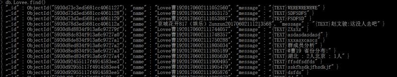

[](https://github.com/chatie/wechaty)

# Wechaty 

## Connecting ChatBots.

Wechaty is a Bot Framework for Wechat **Personal** Account which can help you create a bot in 6 lines of javascript by easy to use API, with cross-platform support include [Linux](https://travis-ci.org/chatie/wechaty), [Windows](https://ci.appveyor.com/project/chatie/wechaty), [Darwin(OSX/Mac)](https://travis-ci.org/chatie/wechaty) and [Docker](https://circleci.com/gh/chatie/wechaty).

[](https://nodejs.org/)
[](https://github.com/ellerbrock/typescript-badges/)
[](https://github.com/chatie/wechaty)

:octocat: <https://github.com/chatie/wechaty>  
:beetle: <https://github.com/chatie/wechaty/issues>  
:book: <https://github.com/chatie/wechaty/wiki>  
:whale: <https://hub.docker.com/r/zixia/wechaty>  

#Wechaty 群分析统计机器人

##1.文字显示群分析结果
源码demo1.ts
使用流程：
 - 用户在群里发送“群消息分析”
 - “我” @用户并发送登录后群成员聊天条数的统计结果文字
 - 用户在群里发送“群成员分析”
 - “我”@用户发送统计群里的成员的城市和性别数量统计
 




方法：
- 通过wechaty提供 api 获取数据群成员名字、性别和地区，使用HashMap设置key为成员名字、性别和城市，统计数据value值加一，统计后“我”在群里面@用户统计结果
- 群成员发送的消息会存在MongoDB中，MongoDB中name为Room.topic() + member.name() + 时间戳，时间戳是通过npm中的time-stamp获取，timestamp('YYYYMMDDHHmmssms')

##2.图片显示群分析结果
源码demo.ts index.html
使用流程：
 - 用户在群里发送“群消息分析”
 - “我” @用户并发送登录后群成员聊天条数的统计结果图表
 
 
 
 方法：
- 使用wechaty的API获得群成员所有的信息，并创建以群成员name为key的Hashmap对应的Value初始值为0，每当有成员发送消息value值加一。
- 通过express创建一个显示页面（index.html）和数据页面(/pic)，代码如下：
index.html
```sh	
 app.get('/', function (req, res) {
res.sendFile( __dirname + "/" + "index.html" );
});
```
demo.ts中上传membermessage群成员消息统计数
```sh
app.get('/pic',function(req,res){ var data={  data1:membermessages
            }
		res.send(data);
		});
```
Index.html中的script通过ajax获取/pic页面中的数据
```sh
	$.ajax({
            url: '/pic',
            type: 'get',
            dataType: 'json',
            success:function(data){
                $('#text').html(data.data1._data);
				name1 =  data.data1._data;
				alert(data.data1._data);
				alert(name1);
            },
            error:function(data){
                alert('error');
            }
        });
```
- 显示页面index.html通过script中的ajax获取数据页面的数据，并显示在显示页面中。
- 通过phantom.js截取显示页面图片，并保存为图片，储存到当前路径
```sh
(async function() {
		const instance = await phantom.create();
		const page = await instance.createPage();
		await page.property('viewportSize', {width: 400, height: 480});
		const status = await page.open('http://192.168.1.102:3000');
		console.log(`Page opened with status [${status}].`);
		await page.render('chat.jpg');
		console.log(`File created at [./stackoverflow.jpg]`);
		await instance.exit();
```
- 使用MediaMessage从当前路径发送phantom.js截取的图片
###目前未调通的缺陷：显示页面的ajax不知道为什么始终收不到数据页面的数据。


